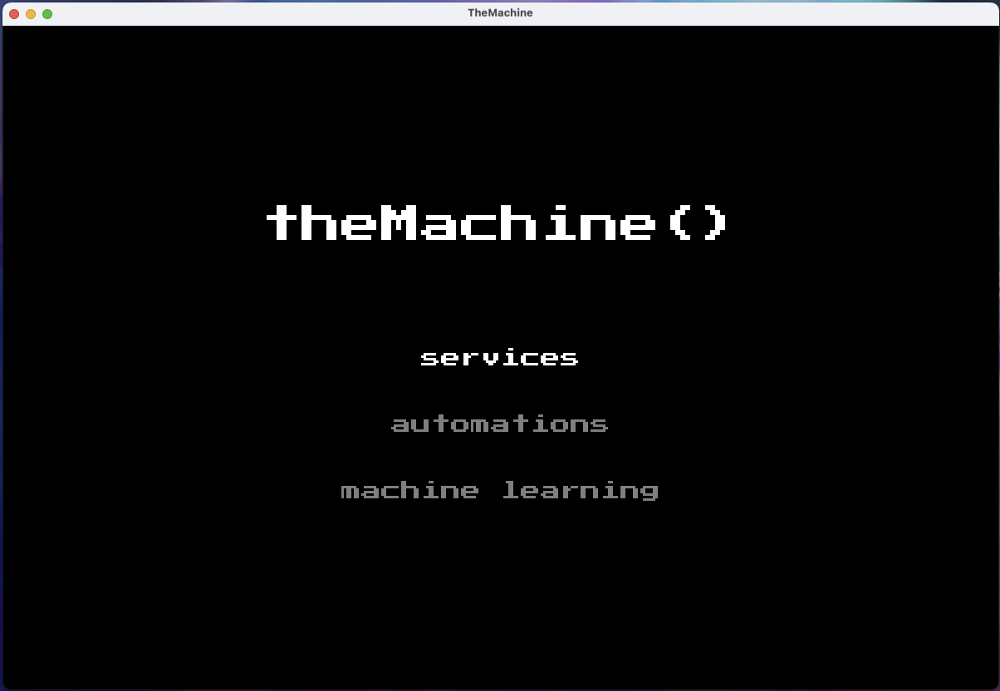
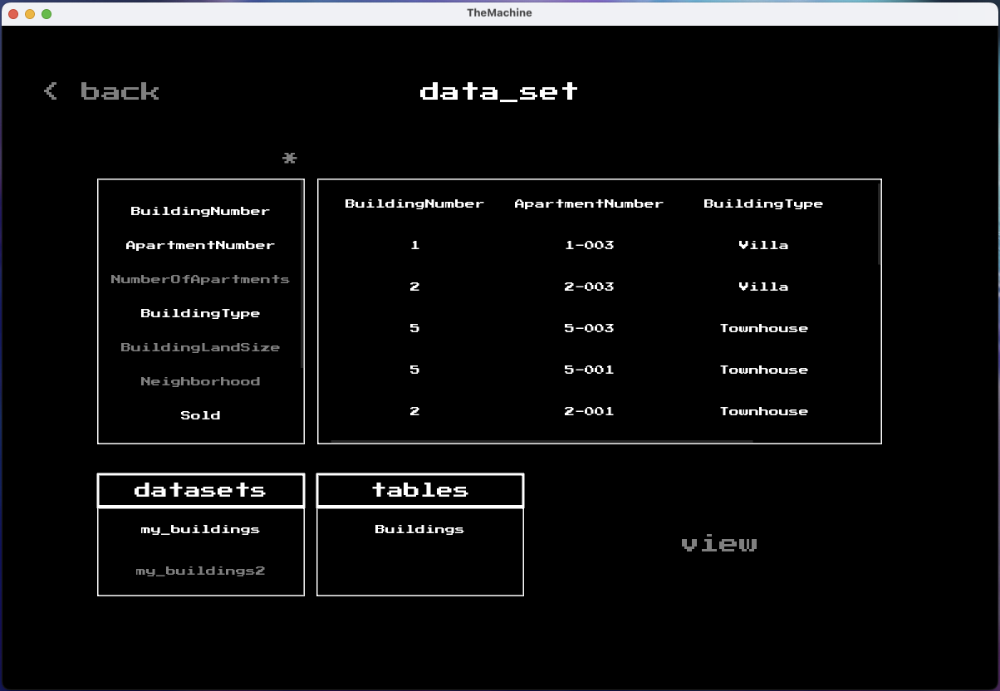
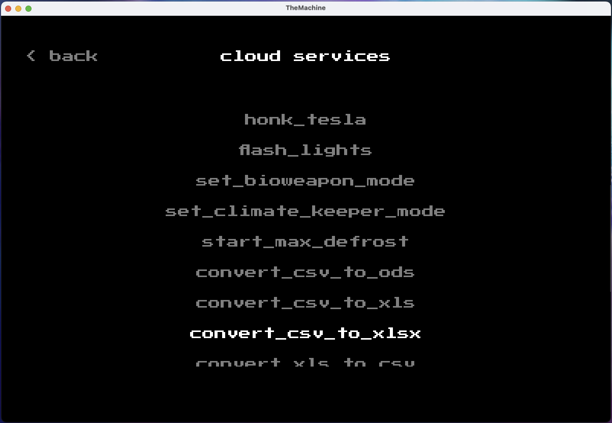
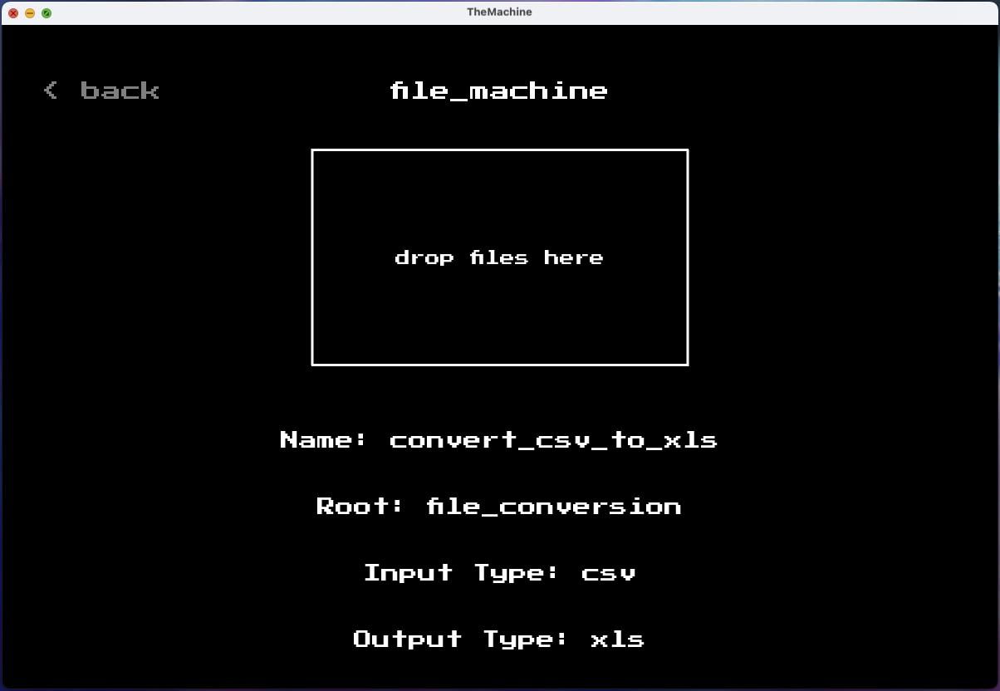

# **Project: The Machine - Automation, Cloud Computing, AI, and Machine Learning**

---

---

## **Welcome to The Machine**

A comprehensive tool that integrates **cloud computing**, **automation**, and **artificial intelligence** techniques. This project focuses on simplifying **data processing**, **file conversions**, and **cloud-based task management**, while offering powerful features for **AI-driven decision-making** and automation. This document provides an overview of the project’s microservices, key features, and its roadmap for future updates.

---

## **Key Features Overview**

The project focuses on automation through **cloud computing**, **machine learning**, and **AI** techniques. It consists of five distinct microservices:

  <strong>App Services | Web Services (Cloud and Hybrid) | Automation Services | Machine Learning Services</strong>

---

### **App Services**

The **app services** focus on the application’s core data processing functionality, leveraging **machine learning techniques** to handle data sorting and filtering.

- **Data Sorting**: App services use intelligent sorting techniques to manage complex data sets.
- **Google BigQuery Integration**: Users can interact with datasets stored in **Google BigQuery**, allowing for easy access and filtering of structured data.
- **Data Visualization**: App services provide an interface to view, sort, and manipulate datasets, supporting key operations like set theory, data cleaning, and more.

---

### **Web Services (Cloud and Hybrid)**

The **web services** are split into two sub-services:

- **Cloud Services**: These services rely on **Google Cloud Functions** and **Google Cloud Storage** to run serverless, scalable operations, such as file conversion or API control.
- **Hybrid Services**: Hybrid services execute **Google Cloud Storage** scripts locally, enabling seamless execution on the user’s machine while maintaining cloud-level automation. Each service script is dynamically pulled based on task type, ensuring optimal efficiency.
- **Function Hub**: The cloud functions are managed centrally through a **Function Hub**, where functions are sorted and executed according to their deployment validity. The Function Hub controls access and deployment via **Google Functions** and **Google Storage**, ensuring all deployed services are up-to-date and secure.

---

### **Automation Services**

The **automation services** bring everything together by connecting **web services** with external tools like **UiPath** and **Power Automate**:

- **Control Over Web Services**: Automation services manage and orchestrate web services to execute cloud functions and handle data in Google Storage. This enables complex automation workflows that span multiple services.
- **Comprehensive Automation Solutions**: Using **UiPath** and **Power Automate**, the automation layer helps control, schedule, and automate tasks across different microservices, creating **end-to-end solutions**.

---

### **Machine Learning Services**

The **machine learning service** leverages AI to perform advanced data analysis, task replication, and decision-making automation.

- **AI Task Replication**: By using AI techniques, such as **AI vision** and **prompt understanding**, the machine learning service aims to replicate specific tasks based on user inputs or observed actions.
- **Data Analysis and Decision Making**: The machine learning models analyze data to make informed decisions, improving **task efficiency** and **accuracy**.
- **Enhanced AI Techniques**: With advanced AI methods, this service is designed to enhance decision-making, predict outcomes, and take real-time actions.

---

## **Security and Scalability**

- **Environment Variable Management**: Sensitive information such as API keys and credentials is handled securely through environment variables stored in .env files.
- **Google Secret Manager**: All deployed cloud functions already use **Google Secret Manager** to securely handle API credentials and other sensitive data.
- **Hybrid Services**: The hybrid model ensures that services are scalable and efficient, reducing costs while maintaining local processing power.
- **Token and Credential Handling**: The tool uses automated token refresh methods to ensure continuous authentication, even for long-running tasks.
- **Scalability**: Cloud-based functions allow for seamless scaling, especially with **Google Cloud Functions**, ensuring that workflows can handle high volumes of data or requests.
- **Ease of Deployment**: The deployment process for both **cloud** and **hybrid functions** is designed to be straightforward, allowing users to quickly deploy and run their functions with minimal setup.
- **Library Management**: The tool provides control over installed libraries within the user’s virtual environment, ensuring that the libraries specific to **The Machine** do not interfere with the global environment.
- **Cross-Platform Compatibility**: **The Machine** is compatible with both **Windows** and **Mac** environments, offering flexible deployment and execution options across different platforms.

---

## **Services Workflow**

---

## **UI Snapshots**

---
## **Conclusion**

**The Machine** is a robust tool designed to automate workflows, leverage AI for decision-making, and enable scalable cloud computing. The combination of **web services**, **automation services**, and **machine learning services** makes it a comprehensive solution for developers, businesses, and anyone looking to automate data-heavy processes.
